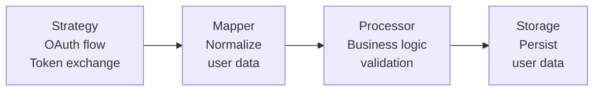
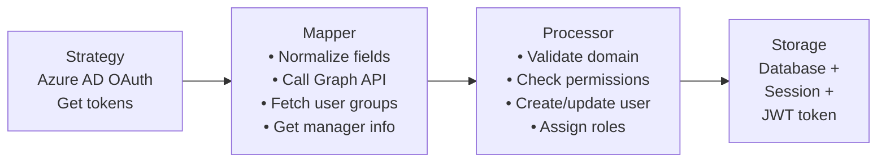
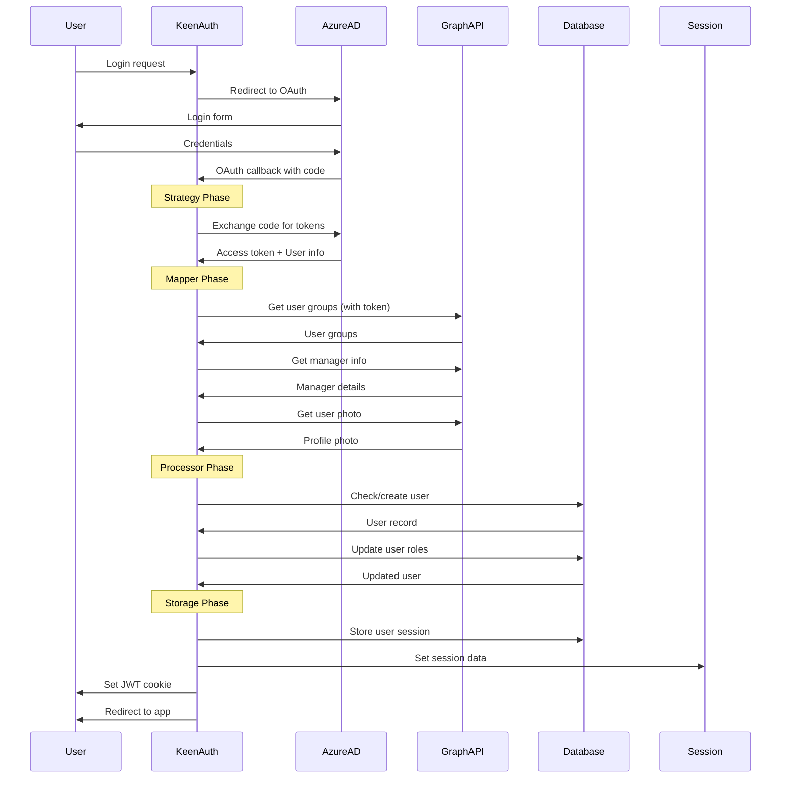

# KeenAuth

A powerful and flexible OAuth authentication library for Phoenix applications. KeenAuth provides a clean pipeline architecture that separates concerns into three main components: Strategy, Mapper, and Storage.

## Architecture Overview

KeenAuth follows a pipeline approach where each authentication stage can be customized independently:

```
User → Strategy → Mapper → Processor → Storage
       (OAuth)   (Normalize) (Business Logic) (Persist)
```

### Core Components

- **Strategy**: Handles provider-specific OAuth protocols (Azure AD, GitHub, Facebook, etc.)
- **Mapper**: Normalizes provider responses and can enrich data with additional API calls
- **Processor**: Implements business logic, user validation, and transformations
- **Storage**: Manages user data persistence (sessions, database, JWT, etc.)

## Basic Flow Diagram



## Advanced Example: Azure AD with Graph API

### Pipeline Flow


### Detailed Interaction Flow


## Installation

Add `keen_auth` to your list of dependencies in `mix.exs`:

```elixir
def deps do
  [
    {:keen_auth, "~> 0.2.0"}
  ]
end
```

## Quick Start

### 1. Configuration

Add to your `config.exs`:

> [!IMPORTANT]
> **OAuth Scopes**: KeenAuth automatically requests `openid profile email offline_access` scopes if you don't specify any. This ensures user profile data is returned by the provider. If you specify custom scopes via `authorization_params: [scope: "..."]`, make sure to include at least `openid profile email` or you may receive empty user data.

```elixir
config :keen_auth,
  strategies: [
    azure_ad: [
      strategy: Assent.Strategy.AzureAD,
      mapper: KeenAuth.Mappers.AzureAD,
      processor: MyApp.Auth.Processor,
      config: [
        tenant_id: System.get_env("AZURE_TENANT_ID"),
        client_id: System.get_env("AZURE_CLIENT_ID"),
        client_secret: System.get_env("AZURE_CLIENT_SECRET"),
        redirect_uri: "https://myapp.com/auth/azure_ad/callback"
      ]
    ],
    github: [
      strategy: Assent.Strategy.Github,
      mapper: KeenAuth.Mappers.Github,
      processor: MyApp.Auth.Processor,
      config: [
        client_id: System.get_env("GITHUB_CLIENT_ID"),
        client_secret: System.get_env("GITHUB_CLIENT_SECRET"),
        redirect_uri: "https://myapp.com/auth/github/callback"
      ]
    ]
  ]
```

### 2. Router Setup

```elixir
defmodule MyAppWeb.Router do
  require KeenAuth

  pipeline :auth do
    plug :fetch_session
    plug KeenAuth.Plug.FetchUser
  end

  scope "/auth" do
    pipe_through :auth
    KeenAuth.authentication_routes()
  end
end
```

### 3. Endpoint Configuration

Add the KeenAuth plug to your endpoint:

```elixir
defmodule MyAppWeb.Endpoint do
  plug KeenAuth.Plug
  plug MyAppWeb.Router
end
```

## Custom Implementation Examples

### Basic Processor

```elixir
defmodule MyApp.Auth.Processor do
  @behaviour KeenAuth.Processor

  def process(conn, provider, mapped_user, oauth_response) do
    # Simple pass-through
    {:ok, conn, mapped_user, oauth_response}
  end

  def sign_out(conn, provider, params) do
    conn
    |> KeenAuth.Storage.delete()
    |> Phoenix.Controller.redirect(to: "/")
  end
end
```

### Advanced Processor with Database Integration

```elixir
defmodule MyApp.Auth.Processor do
  @behaviour KeenAuth.Processor
  alias MyApp.{Accounts, Repo}

  def process(conn, provider, mapped_user, oauth_response) do
    with {:ok, user} <- find_or_create_user(mapped_user),
         :ok <- validate_user_permissions(user),
         {:ok, user} <- assign_user_roles(user, oauth_response) do
      {:ok, conn, user, oauth_response}
    else
      {:error, reason} ->
        conn
        |> Phoenix.Controller.put_flash(:error, "Authentication failed: #{reason}")
        |> Phoenix.Controller.redirect(to: "/login")
    end
  end

  defp find_or_create_user(mapped_user) do
    case Accounts.get_user_by_email(mapped_user.email) do
      nil -> Accounts.create_user(mapped_user)
      user -> {:ok, user}
    end
  end

  defp validate_user_permissions(user) do
    if user.active and valid_domain?(user.email) do
      :ok
    else
      {:error, "Access denied"}
    end
  end

  defp assign_user_roles(user, %{groups: groups}) do
    # Assign roles based on Azure AD groups
    roles = map_groups_to_roles(groups)
    Accounts.update_user_roles(user, roles)
  end
end
```

### Custom Mapper with Graph API Integration

```elixir
defmodule MyApp.Auth.AzureADMapper do
  @behaviour KeenAuth.Mapper
  alias MyApp.GraphAPI

  def map(provider, user_data) do
    # Start with basic normalization
    base_user = %{
      email: user_data["userPrincipalName"],
      name: user_data["displayName"],
      provider: provider
    }

    # Enrich with Graph API data
    with {:ok, token} <- get_graph_token(),
         {:ok, groups} <- GraphAPI.get_user_groups(token, base_user.email),
         {:ok, manager} <- GraphAPI.get_user_manager(token, base_user.email),
         {:ok, photo} <- GraphAPI.get_user_photo(token, base_user.email) do

      base_user
      |> Map.put(:groups, groups)
      |> Map.put(:manager, manager)
      |> Map.put(:profile_photo, photo)
    else
      _ -> base_user  # Fallback to basic data if enrichment fails
    end
  end
end
```

## Route Protection

### Require Authentication

```elixir
pipeline :authenticated do
  plug KeenAuth.Plug.RequireAuthenticated, redirect: "/login"
end

scope "/admin", MyAppWeb do
  pipe_through [:browser, :authenticated]

  get "/dashboard", AdminController, :dashboard
end
```

### Role-Based Authorization

```elixir
pipeline :admin_required do
  plug KeenAuth.Plug.RequireAuthenticated
  plug KeenAuth.Plug.Authorize.Roles, roles: ["admin", "super_admin"]
end

scope "/admin", MyAppWeb do
  pipe_through [:browser, :admin_required]

  resources "/users", UserController
end
```

## Storage Options

### Session Storage (Default)

```elixir
# No additional configuration needed
```

### Database Storage

```elixir
defmodule MyApp.Auth.DatabaseStorage do
  @behaviour KeenAuth.Storage
  alias MyApp.{Accounts, Sessions}

  def store(conn, provider, user, oauth_response) do
    with {:ok, session} <- Sessions.create_session(user, provider),
         conn <- Plug.Conn.put_session(conn, :session_id, session.id) do
      {:ok, conn}
    end
  end

  def current_user(conn) do
    with session_id when not is_nil(session_id) <- Plug.Conn.get_session(conn, :session_id),
         %{user: user} <- Sessions.get_session(session_id) do
      user
    else
      _ -> nil
    end
  end

  # Implement other required callbacks...
end
```

### JWT Token Storage

```elixir
defmodule MyApp.Auth.JWTStorage do
  @behaviour KeenAuth.Storage
  use Joken.Config

  def store(conn, provider, user, oauth_response) do
    token = generate_and_sign!(%{user_id: user.id, provider: provider})

    conn =
      conn
      |> Plug.Conn.put_resp_cookie("auth_token", token, http_only: true, secure: true)
      |> KeenAuth.assign_current_user(user)

    {:ok, conn}
  end
end
```

## Helper Functions

### Check Authentication Status

```elixir
# In your controllers or views
if KeenAuth.authenticated?(conn) do
  current_user = KeenAuth.current_user(conn)
  # User is authenticated
else
  # User is not authenticated
end
```

### Sign Out

```elixir
def sign_out(conn, _params) do
  conn
  |> KeenAuth.Storage.delete()
  |> redirect(to: "/")
end
```

## Configuration Reference

### OAuth Scopes

> [!WARNING]
> If you override `authorization_params` with custom scopes, you **must** include the essential OIDC scopes or you will receive empty user data from the provider.

KeenAuth automatically includes these default scopes when none are specified:

```
openid profile email offline_access
```

**What each scope provides:**
- `openid` - Required for OIDC, returns `sub` (user ID)
- `profile` - Returns `name`, `preferred_username`, etc.
- `email` - Returns user's email address
- `offline_access` - Returns refresh token for token renewal

**Custom scopes example:**
```elixir
# If you need additional scopes (e.g., Microsoft Graph API access),
# always include the base OIDC scopes:
config: [
  authorization_params: [
    scope: "openid profile email offline_access User.Read Directory.Read.All"
  ]
]
```

### Complete Configuration Example

```elixir
config :keen_auth,
  # Optional: Custom storage implementation
  storage: MyApp.Auth.CustomStorage,

  # Optional: Global unauthorized redirect
  unauthorized_redirect: "/login",

  # OAuth strategies
  strategies: [
    azure_ad: [
      strategy: Assent.Strategy.AzureAD,
      mapper: MyApp.Auth.AzureADMapper,
      processor: MyApp.Auth.Processor,
      config: [
        tenant_id: System.get_env("AZURE_TENANT_ID"),
        client_id: System.get_env("AZURE_CLIENT_ID"),
        client_secret: System.get_env("AZURE_CLIENT_SECRET"),
        redirect_uri: "https://myapp.com/auth/azure_ad/callback",
        scope: "openid profile email User.Read"
      ]
    ],
    google: [
      strategy: Assent.Strategy.Google,
      mapper: KeenAuth.Mappers.Default,
      processor: MyApp.Auth.Processor,
      config: [
        client_id: System.get_env("GOOGLE_CLIENT_ID"),
        client_secret: System.get_env("GOOGLE_CLIENT_SECRET"),
        redirect_uri: "https://myapp.com/auth/google/callback"
      ]
    ]
  ]
```

## Supported Providers

KeenAuth supports all OAuth providers available through the [Assent](https://github.com/pow-auth/assent) library:

- Azure Active Directory
- Google
- GitHub
- Facebook
- Twitter
- LinkedIn
- Discord
- And many more

## Development

### Running Tests

```bash
mix deps.get
mix test
```

### Code Formatting

```bash
mix format
```

### Generating Documentation

```bash
mix docs
```

## Contributing

1. Fork the repository
2. Create your feature branch (`git checkout -b feature/amazing-feature`)
3. Commit your changes (`git commit -m 'Add amazing feature'`)
4. Push to the branch (`git push origin feature/amazing-feature`)
5. Open a Pull Request

## License

This project is licensed under the MIT License - see the [LICENSE](LICENSE) file for details.

## Support

- Documentation: [HexDocs](https://hexdocs.pm/keen_auth)
- Issues: [GitHub Issues](https://github.com/KeenMate/keen_auth/issues)
- Source: [GitHub](https://github.com/KeenMate/keen_auth)